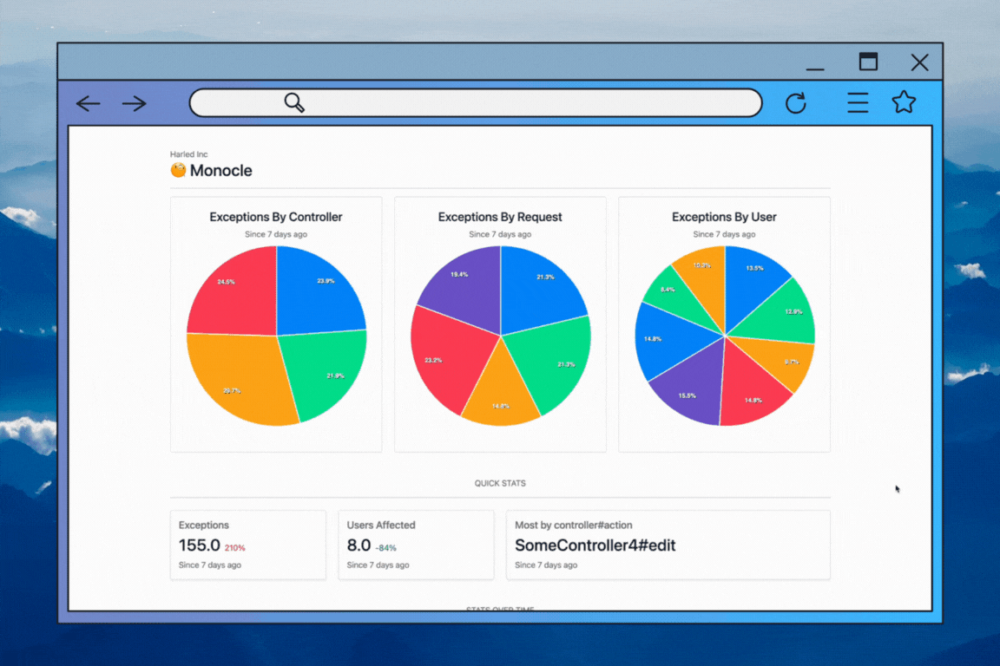

<h1 align="center">
  <br>
  
  <br>
  Monocle
  <br>
</h1>

Monocle is a suite of [ViewComponents](https://github.com/github/view_component) to provide insights to your Buy on Rails application based on authorization exceptions generated by [Pundit](https://github.com/varvet/pundit).

This information can help improve security and useability. You and your team will be surprised to see what you can learn from 401 Unauthorized!



## Dependencies
Monocle depends on the following libraries:

* [ViewComponent](https://github.com/ViewComponent/view_component)
* [Bootstrap](https://getbootstrap.com/docs/5.0/getting-started/introduction/)
* [Groupdate](https://github.com/ankane/groupdate)
* [ApexCharts](https://www.npmjs.com/package/apexcharts)

## Installation

Add this line to your application's Gemfile:

```ruby
# Gemfile
gem 'monocle'
```

And then execute:

    $ bundle install

Or install it yourself as:

    $ gem install monocle

To generate the migration and build the data model, run:

```base
rails generate monocle:authorization_exceptions
rails db:migrate
```

## Usage
Once you have Monocle loaded you can render any of its view components. For example, you could render the `Monocle::ControllersOverTimeComponent` with:

```erb
<%= render Monocle::ControllersOverTimeComponent.new(events: AuthorizationException.all) %>
```

With a full list of components here:
|Component|Purpose|
|---------|-------|
|ControllersOverTimeComponent|Shows the number of events over time.|
|HighestControllerActionCountComponent|Shows the controller endpoint which has caused the most authorization exceptions given the events passed in.|
|ExceptionsByControllerComponent|Shows the number of events grouped by controller name.
|ExceptionsByRequestComponent|Shows the number of events grouped by request.|
|ExceptionsByUserComponent|Shows the number of events grouped by user id.|
|ExceptionsSinceTimeAgoComponent|Shows the number of exceptions over a specified period of time and the percentage increase over time.|
|TopTenUsersComponent|Shows the top ten users in terms of who caused most authorization exceptions.|
|UsersAffectedSinceTimeAgoComponent|Shows the number of users affected over a given time period.|

For more information about each view component, including the method signature, look for the `.rb` files in the `app/components/monocle` directory.

## Development

Monocle development is made easy with vscode [devcontainers](https://containers.dev/). Once the repo has been checked out, open the project in a devcontainer and 
then open a new terminal.

```bash
# install required packages
bin/setup

# install spec/sample packages
bundle install --gemfile spec/sample/Gemfile

# run test cases and ensure everything is passing
rake spec

# an interactive prompt that will allow you to experiment with monocle
bin/console
```

To install this gem onto your local machine, run `bundle exec rake install`. 

### Sample Application

ViewComponents are pretty hard to test without a Ruby on Rails application. This repository includes a sample application that makes it easy to see how a component renders and make quick adjustments.

To use the sample application: 

```
# change directory to the sample project
cd spec/sample

# install packages (if not already done)
bundle install

# migrate the database
rails db:migrate

# seed data with mock exceptions
rails db:seed

# run the server
bundle exec rails server

# open your browser to localhost:3000
```


## Release

To release a new version, update the version number in `version.rb`, and then run `bundle exec rake release`, which will create a git tag for the version, push git commits and the created tag, and push the `.gem` file to [rubygems.org](https://rubygems.org).

## Contributing
Bug reports and pull requests are welcome on GitHub at https://github.com/harled/monocle. This project is intended to be a safe, welcoming space for collaboration, and contributors are expected to adhere to the code of conduct.

### Contribution Steps:

Want to help us out? Here are some steps to make sure you are contributing

1. Find an issue you like, or create a new issue here
Please ask for any questions or clarifications in the associated issues or in new issues! 🤔
2. Assign yourself to the issue and create a branch , following GitHub Issue's naming scheme. 🛠️
The naming scheme should follow (#issueNumber-issue-name) ie. (#10-create-new-component)
3. Get on your local machine and ensure you have the repo cloned. Checkout the branch you just made with git checkout branch-name and pull the latest merged changes from the repo with git pull origin main to make sure you have the most up-to-date code from the repo. 👩‍💻
4. Add your amazing changes along with any documentation you feel would be useful. Then commit and push your changes. 🌟
5. Go back to the repo on GitHub and create a pull request! Then wait for an admin of the repo to get back to your pull request, address any comments and once you are finally approved, merge your code into Monocle! 🎉

If you want some more tips on contributing to GitHub projects, check out this resource from Data School.

## License

The gem is available as open source under the terms of the [MIT License](https://opensource.org/licenses/MIT).

## Code of Conduct

Everyone interacting in the Monocle project's codebases, issue trackers, chat rooms and mailing lists is expected to follow the [code of conduct](CODE_OF_CONDUCT.md).
